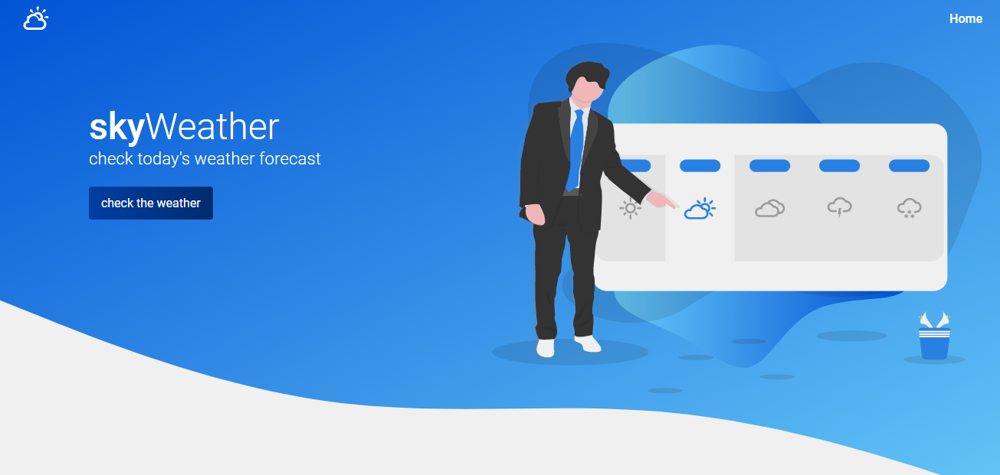

<h1 align="center">
  :cloud:
  <br>
  <br>
  skyWeather
</h1>

<h3 align="center">
<strong>check today's weather forecast</strong>
</h3>

<p align="center">

  
  
  
  
  <br>
  <br>
  <a href="#space_invader-technologies">Technologies</a> |
  <a href="#information_source-how-to-use">How to use</a>
  <br>
  <br>
  
  <br>
  <br>
  <a href="https://sky-weather.netlify.app/" target="_blank">
    
  </a>
</p>

## :space_invader: Technologies

- [ReactJS](https://pt-br.reactjs.org/)
- Typescript
- [React Router](https://reacttraining.com/react-router/web/guides/quick-start)
- [React Icons](https://react-icons.github.io/react-icons/)
- [React toastify](https://github.com/fkhadra/react-toastify)
- [React loading](https://github.com/fakiolinho/react-loading)
- [React moment](https://github.com/headzoo/react-moment)
- [Axios](https://github.com/axios/axios)
- [Styled components](https://styled-components.com/)
- [Yup](https://github.com/jquense/yup)
- [OpenWeather API](https://openweathermap.org/api)
- [Polished](https://github.com/styled-components/polished)
- [unDraw](https://undraw.co/)

## :information_source: How to use

To run this project you'll need [GIT](https://git-scm.com/), [NodeJS](https://nodejs.org/en/) and [Yarn](https://yarnpkg.com/) installed on your computer.

```bash
# Clone this repository
$ git clone https://github.com/rafashiga/weatherapp.git

# Go into the repository
$ cd weatherapp

# Install dependencies
$ yarn install

# Run the project
$ yarn start
```
